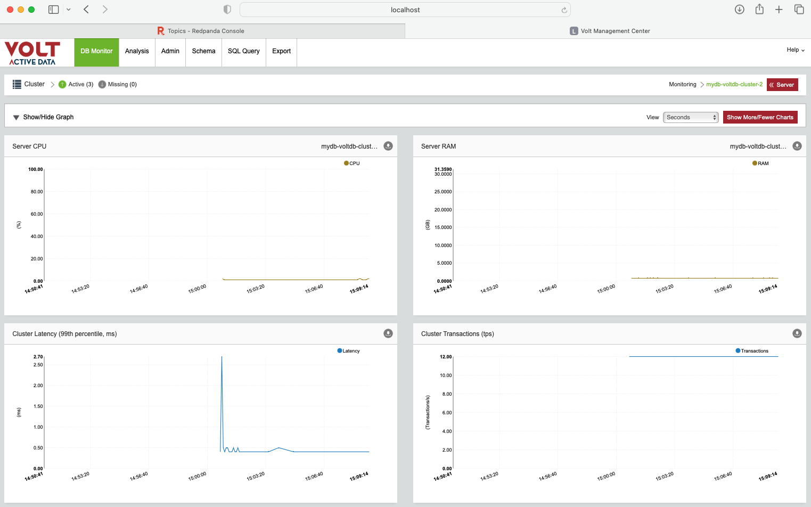
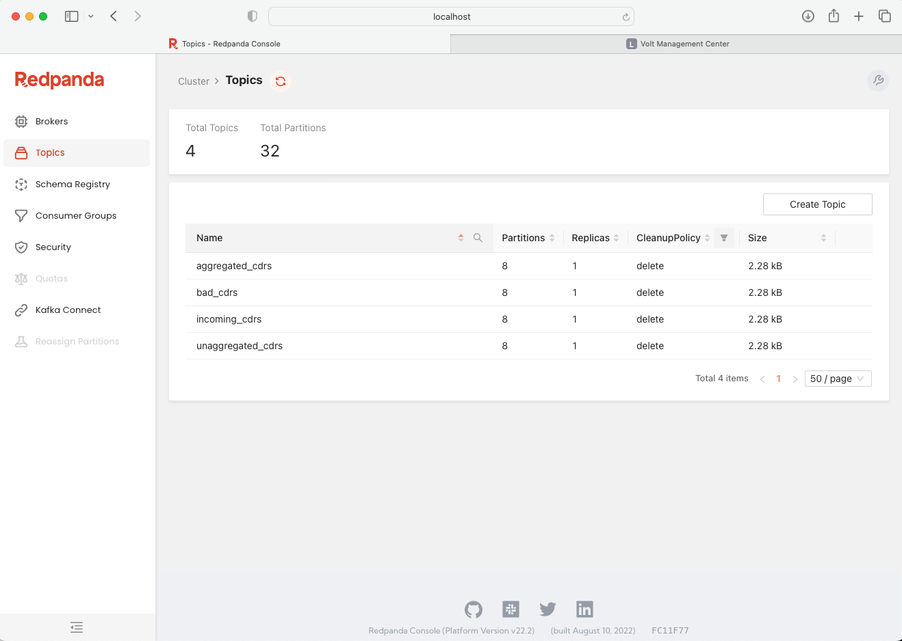

# effective-guacamole
Blog repo for volt redpanda integration

All the technologies are deployed on cloud infrastructure using helm charts. helm charts make the deployment process swift and easy for any engineer to install the applications without having to follow complex instructions and creating a tree of directories. 

For the sake of these steps, we assume that kubernetes cluster is installed and ready with appropriate network configurations. From here the steps are same for public cloud or private cloud.

## Adding Helm Repos

```zsh
helm repo add voltdb 'https://voltdb-kubernetes-charts.storage.googleapis.com'

helm repo add redpanda 'https://charts.redpanda.com'

helm repo add redpanda-console 'https://dl.redpanda.com/public/console/helm/charts/' 

helm repo add prometheus-community 'https://prometheus-community.github.io/helm-charts'

```
## Installing Volt

We can start a simple 3 node volt cluster using only the license file and helm charts present on the remote repository.

default resource request is 1vCPU and 4Gi RAM 1Gi Storage and no limits are set, so the pods use what is avaiable to underlying hosts
command log on
snapshots on
SPH 8
K-Factor 1


```zsh

helm install mydb voltdb/voltdb --wait --set-file cluster.config.licenseXMLFile=license.xml --version="1.8.3" --namespace volt

```

## Installing Redpanda
Similarly, Redpanda out of the box setup is, 

```zsh

helm install redpanda redpanda/redpanda --version=2.3.14 --namespace redpanda


helm install rp-console redpanda-console/console --values console.yaml -n redpanda

```

### Let's verify both deployments

```zsh

% kubectl get pods -n volt
NAME                                    READY   STATUS    RESTARTS 
mydb-voltdb-cluster-0                   1/1     Running   0         
mydb-voltdb-cluster-1                   1/1     Running   0         
mydb-voltdb-cluster-2                   1/1     Running   0         
mydb-voltdb-operator-7b7f6f59f8-2ssjz   1/1     Running   0          

```

```zsh
% kubectl get pods -n redpanda
NAME                          READY   STATUS      RESTARTS 
redpanda-0                    1/1     Running     0          
redpanda-1                    1/1     Running     0          
redpanda-2                    1/1     Running     0          
redpanda-post-install-kdnpw   0/1     Completed   0          
```
## Schema and Topics
The schema details for Volt are in [voltdb-aggdemo-createDB.sql](./voltdb-aggdemo-createDB.sql)

```zsh

% kubectl cp procs.jar mydb-voltdb-cluster-0:/tmp/ -n volt

% kubectl exec -it mydb-voltdb-cluster-0 -n volt -- sqlcmd < voltdb-aggdemo-createDB.sql

```

Let's create the topics we will use in Redpanda,

Incoming_cdrs
Unaggregated_cdrs
Bad_cdrs
Aggregated_cdrs

```zsh

% kubectl -n redpanda exec -ti redpanda-0 -c redpanda -- rpk topic create incoming_cdrs --partitions 8 --replicas 1 --brokers redpanda-0.redpanda.redpanda.svc.cluster.local.:9093,redpanda-1.redpanda.redpanda.svc.cluster.local.:9093,redpanda-2.redpanda.redpanda.svc.cluster.local.:9093
TOPIC          STATUS
incoming_cdrs  OK

% kubectl -n redpanda exec -ti redpanda-0 -c redpanda -- rpk topic create unaggregated_cdrs --partitions 8 --replicas 1 --brokers redpanda-0.redpanda.redpanda.svc.cluster.local.:9093,redpanda-1.redpanda.redpanda.svc.cluster.local.:9093,redpanda-2.redpanda.redpanda.svc.cluster.local.:9093
TOPIC              STATUS
unaggregated_cdrs  OK

% kubectl -n redpanda exec -ti redpanda-0 -c redpanda -- rpk topic create aggregated_cdrs --partitions 8 --replicas 1 --brokers redpanda-0.redpanda.redpanda.svc.cluster.local.:9093,redpanda-1.redpanda.redpanda.svc.cluster.local.:9093,redpanda-2.redpanda.redpanda.svc.cluster.local.:9093
TOPIC            STATUS
aggregated_cdrs  OK

% kubectl -n redpanda exec -ti redpanda-0 -c redpanda -- rpk topic create bad_cdrs --partitions 8 --replicas 1 --brokers redpanda-0.redpanda.redpanda.svc.cluster.local.:9093,redpanda-1.redpanda.redpanda.svc.cluster.local.:9093,redpanda-2.redpanda.redpanda.svc.cluster.local.:9093
TOPIC     STATUS
bad_cdrs  OK

```
## Accessing Consoles

We access __Volt Management console__ using port forwarding on service, once we run the following command we can access console from `http://localhost:8081`

```zsh

% kubectl port-forward service/mydb-voltdb-cluster-http -n volt 8081:8080

```	




We access __Redpanda console__ using port forwarding on pod, once we run the following command we can access the console from `http://localhost:8080`

```zsh

% kubectl port-forward rp-console-6d49576f4-pnp4v -n redpanda 8080:8080

```



## Integration

The files in this repo are used to integrate the systems along with helm upgrade

- [import.yaml](./import.yaml) : For incoming msgs into Volt from Redpanda topic
- [export.yaml](./export.yaml) : For outgoing processed or filtered msgs from Volt to Redpanda topic
- [testClient.yaml](./testClient.yaml) : For incoming load simulation msgs from client to Redpanda topic

### Import - Volt
A glimse at the import configs being simple and small, needing no restart of pods/ system.

```yaml
cluster:
  config: 
    deployment:   
      import:
        configurations:
        - type: "kafka"
          enabled: 'true'
          format: "csv"
          properties:
            topics: "incoming_cdrs"          #Pulls from this Topic
            procedure: "HandleMediationCDR"  #Name of the StoredProcedure that will do work on the incoming messages
            brokers: "<<REPLACE_WITH_YOUR_REDPANDA_BROKERS_SVC>>"

```
```zsh

% helm upgrade mydb voltdb/voltdb --version=1.8.3 -n volt  --reuse-values  --values import.yaml

Release "mydb" has been upgraded. Happy Helming!
NAME: mydb
NAMESPACE: volt
STATUS: deployed
REVISION: 2

```
This has the incoming pipeline set between Redpanda Brokers and Volt

### Export - Volt

The export configurations come under the same hierarchy of __cluster.config.deployment.__

```yaml 
      export:
        configurations:
        - target: "unaggregated_cdrs" #Target Topic 1
          type: kafka                 #Kafka API 
          enabled: 'true'
          properties:
            bootstrap.servers: "<<REPLACE_WITH_YOUR_REDPANDA_BROKERS_SVC>>"
            topic.key: "unaggregated_cdrs.unaggregated_cdrs"
        - target: "bad_cdrs"			#Target Topic 2
          type: kafka
          enabled: 'true'
          properties:
            bootstrap.servers: "<<REPLACE_WITH_YOUR_REDPANDA_BROKERS_SVC>>"
            topic.key: "bad_cdrs.bad_cdrs"
        - target: "aggregated_cdrs"			#Target Topic 3
          type: kafka
          enabled: 'true'
          properties:
            bootstrap.servers: "<<REPLACE_WITH_YOUR_REDPANDA_BROKERS_SVC>>"
            topic.key: "aggregated_cdrs.aggregated_cdrs"
```

The above configuration is passed in helm upgrade to upgrade volt export configuration on the fly, without downtime or restart
```zsh

% helm upgrade mydb voltdb/voltdb --version=1.8.3 -n volt  --reuse-values  --values export.yaml

Release "mydb" has been upgraded. Happy Helming!
NAME: mydb
NAMESPACE: volt
STATUS: deployed
REVISION: 3

```
### MessageGenerator - Redpanda

This is the part where the load is generated and directed to the integrated system.

We can control various aspects of the nature of traffic generated to the system. It takes the following parameters

It takes the following parameters:

|Name|Meaning|Example Value|
|-|-|-|
|hostnames|Which db servers we’re connecting to. |redpanda.svc.fqdn name|
|userCount|How many users we have|500000|
|tpms|How many transactions to attempt each millisecond.|80|
|durationseconds|How many seconds to run for|1800|
|missingRatio|How often to do a global status query. Should be less than durationseconds|600|
|dupRatio|How often we produce a duplicate record. A value of ‘2000’ means that 1 in 2000 records will be a duplicate. A value of ‘-1’ disables duplicate records|2000|
|lateRatio|How often we produce a late record. Late records will be for valid sessions, but will be delivered out of sequence. A value of ‘2000’ means that 1 in 2000 records will be late. A value of ‘-1’ disables late records|2000|
|dateis1970Ratio|How often we produce a late record with an unreasonably early timestamp we can’t process. A value of ‘2000’ means that 1 in 2000 records will be for 1-Jan-1970. A value of ‘-1’ disables these records|2000|
|offset|Number to add to session id’s, which normally start at zero. Used when we want to run multiple copies of the generator at the same time.|0|

Full details about client configurations are [here](https://github.com/srmadscience/voltdb-aggdemo)

In the kubernetes environment we will pass the parameters in **testClient.yaml** 

In the args section of container definition, as shown below

```

# hostnames, usercount, tpms, durationseconds, missing ratio,dup ratio, late ratio, dateis1970ratio, offset --> Legend for params
	spec:       
      containers:       
      - name: c         
        image: jadejakajal13/volt-aggdemo:9
        args: ["java", "-jar", "volt-agg.jar", "redpanda-0.redpanda.redpanda.svc.cluster.local.:9093,redpanda-1.redpanda.redpanda.svc.cluster.local.:9093,redpanda-2.redpanda.redpanda.svc.cluster.local.:9093", "500000", "30", "900", "100000", "100000", "100000", "-1","0"] 

```


## Observing the setup in Action

### Volt Management Console

### Redpanda Console

### Grafana dashboards (Optional, Recommended)

